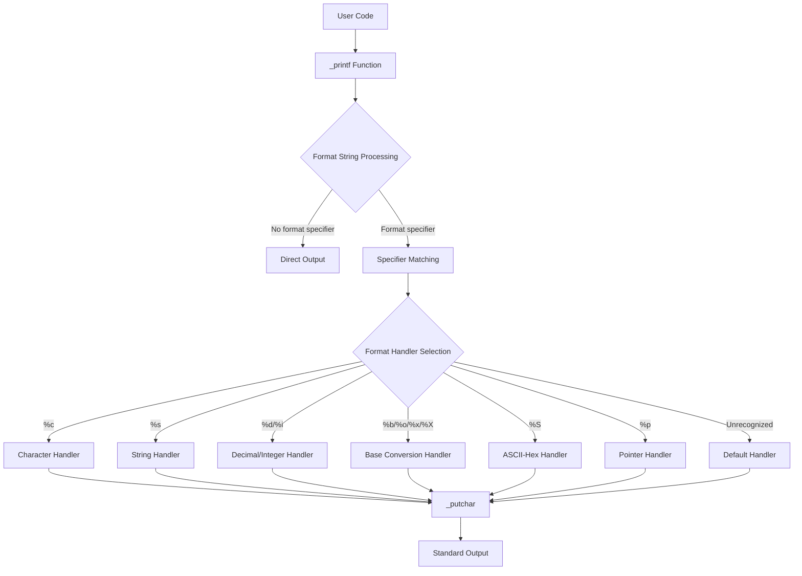
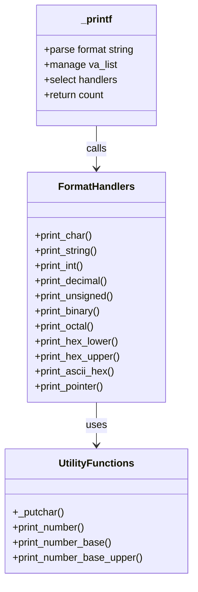
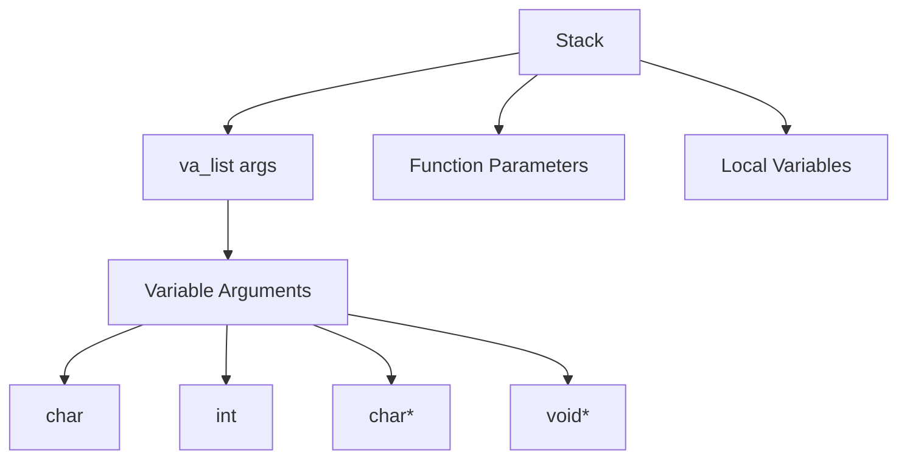
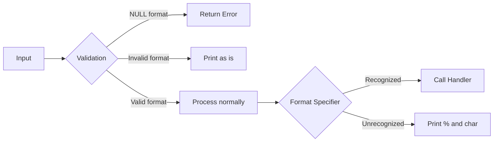
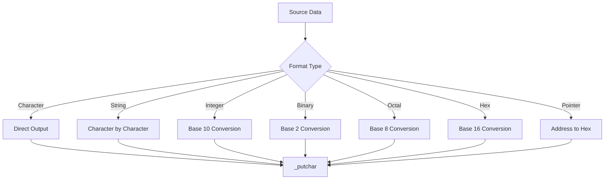

# Printf Project Architecture

## Component Overview

The custom printf implementation follows a modular architecture with specialized components for different format types.

## Flow Diagram

## Component Interactions

## Memory Model

## Error Handling

## Data Transformation

